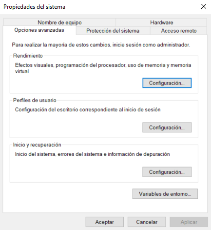

## Apuntes de JAVA

### Antes de empezar

Según una encuesta publicada en web https://www.jetbrains.com/es-es/lp/devecosystem-2023/java/

El 50% de las empresas utilizan la versión 8, seguida de un 45% que utilizan la versión 17.

Además, según el índice Tiobe en Enero de 2024, Java es el cuarto lenguaje más utilizado.

### Instalación de JDK (Java Development Kit)

(Dejo este apartado por si es preciso revisarlo en el futuro, ya que lo he instalado previamente)

En la página https://jdk.java.net/ se pueden instalar las distintas versiones. La última versión estable a día de hoy es la JDK 21.0.2. Aproximadamente, sale una versión nueva cada 6 meses.

**Variables de entorno**

Se puede dar el caso de tener que trabajar en distintas versiones de Java, para ello es conveniente descargar las distintas versiones en una carpeta que podemos llamar jdks. Y para utilizar cada una de las distintas versiones se debe configurar correctamente las "VARIABLES DE ENTORNO".

Para configurar las variables de entorno, en el caso de Windows, debemos ir a propiedades avanzadas del sistema y acceder a variables de entorno:



Una vez que estamos dentro del díalogo de variables de entorno, debemos crear una nueva variable del sistema, que llamaremos JAVA_HOME y pegaríamos la ruta al enlace de nuestra versión de JAVA


Además, debemos configurar la variable de entorno para el usuario, para ello es importante poner la ruta hacia la carpeta bin de JAVA, ya que es donde están los archivos ejecutables.

Accedemos a Path dentro de las variables de usuario haciendo doble click


Una vez que estamos en la variable de usuario y en la variable Path, tenemos dos opciones o añadimos la ruta a la carpeta bin o referenciamos la variable de entorno de la siguiente manera:


Así que cuando queramos utilizar otra versión, tan solo debemos editar las variables de entorno según su versión.

### Estructura de un proyecto, paquete y clase.

Un paquete es una forma de estructurar las clases o archivos de JAVA. Una forma habitual de llamar a los paquetes es invertiendo una URL de una página WEB, por ejemplo "com.example". Si examinamos el paquete con el explorador de archivos de Windows, observaremos que nos ha creado una estructura de carpetas similar a esta ruta: src\com\example. Es decir, nos ha creado una carpeta example dentro de una carpeta com.

En términos sencillos, una clase es un plano o un modelo para crear objetos. Para crear clases, se suele usar CamelCase. En la primera línea es importante que contenga el paquete al que pertenece

```java
package com.example

public class HolaMundo{
}
```

### Método main

El método main es la función fundamental para poder ejecutar cualquier aplicación en JAVA. La JVM (Java Virtual Machine) comienza ejecutando este método cuando se inicia un programa JAVA, excepto que estemos creando una aplicación web en donde el desencadenante del flujo de ejecución sería un controlador que reciba una petición HTTP.

Su sintaxis es la siguiente:

```java
package com.example

public class HolaMundo{
    public static void main(String[] args) {
        System.out.println("Hola Mundo desde Asturias");
    }
}
```

En este código, estamos definiendo una clase llamada 'Hola Mundo'. En Java, cada aplicación debe tener al menos una clase y el nombre del archivo que contiene la clase principal debe coincidir con el nombre de la clase. En este caso, el archivo debe llamarse HolaMundo.java.

- El modificador **'public'** indica que el método es accesible desde cualquier otra clase. Este es el nivel de acceso más alto y permite que un elemento (clase, variable, método, etc.) sea accesible desde cualquier lugar (desde el mismo archivo, paquete e incluso desde clases de otros paquetes).

- El modificador **'static'** significa que está asociado con la clase en sí misma, no con instancias individuales o específicas de esa clase.

#### Ejemplo:

Supongamos que tienes una clase llamada Persona:

```java
public class Persona {
    String nombre;

    public persona(String nombre) {
        this.nombre = nombre;
    }

    public void saludar() {
        System.out.println("Hola, soy " + nombre);
    }
}
```

Se pueden crear instancias específicas de esta clase, es decir, objetos "Persona con nombres diferentes".

```java
Persona persona1 = new Persona("Juan");
Persona persona2 = new Persona("María");
```

Aquí, 'persona 1 ' y 'persona 2' son instancias específicas de la clase persona. Cada instancia tiene datos que son diferentes. Si el método no fuera **estático** se tendría que llamar desde una instancia específica de la clase 'persona'.

```java
persona1.saludar();
persona2.saludar();
```
Pero en el caso del método 'main', se necesita ejecutar sin tener una instancia específica de la clase porque la JVM lo invoca directamente, por eso el método main debe ser **estático**

- El modificador **void**: indica que el método no devuelve ningún dato.
- **(Strings[] args)**: Son los parámetros que recibe el método. En este caso toma un array de cadenas de texto (argumentos de línea de comandos) y 'args' es el nombre del parámetro, que se puede poner el que uno quiera. En JAVA se debe proporcionar un nombre para cada parámetro en la declaración del método, incluso si no se tiene planeado usar el nombre dentro del método.

- **System.out.println(".....")**: Aquí se emplea la clase System para imprimir por consola. 'out' es una instancia de 'PrintStream' y 'println' es un método de esa instancia que imprime una línea en la consola.

 
> Clase: Una clase es como un plano o un molde para crear cosas. Imagina que tienes un plano para construir casas. Ese plano (clase) describe cómo deben ser las casas, qué habitaciones tendrán, cómo se verán, etc.

> Instancia: Una instancia es como una casa específica que se ha construido siguiendo ese plano. Si tienes un plano para construir casas (clase), puedes construir varias casas (instancias) siguiendo ese diseño.

> Método: Un método es como una acción que puede realizar la casa. Siguiendo la analogía, podríamos tener un método llamado "abrirPuerta()" que la casa puede ejecutar para abrir su puerta.


### Tipos de datos y creación de variables

A diferencia de Javascript, JAVA es un lenguaje fuertemente tipado, es decir, hay que especificar el tipo de dato con el que se trabaja.
Los nombres de variables comienzan en minúscula y se suele usar camelCase. Otra diferencia que podemos encontrar con Javascript es que no podemos asignarle un valor **null** a una variable.

```java
package com.example

public class Tipos{
    public static void main(String[] args) {

        // 1.numéricos
        //1.1 enteros: (La diferencia es la cantidad de memoria que pueden ocupar, los más usados son int y long)
        byte variable1 = 10;
        short variable2 = 5;
        int variable3 = 30;
        long variable4 = 100;

        //1.2 decimales
        float variable5 = 5.5f;
        double variable6 = 10.5d;

        //2. booleanos
        boolean variable7 = false;
        boolean variable8 = true;

        //3. texto

        char variable9 = "a";
        String variable = 'palabra';
    }
}
```

> ***Nota importante:*** Aunque no daría error, una buena práctica es empezar el nombre de las variables y funciones con minúscula y las clases con mayúscula. Fijarse que String es una clase.